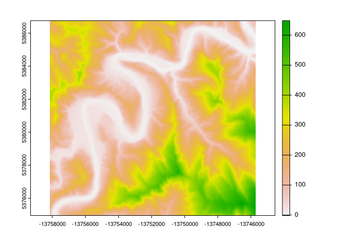

<!-- README.md is generated from README.Rmd. Please edit that file -->

# rrrem

<!-- badges: start -->

[](https://lifecycle.r-lib.org/articles/stages.html#experimental)
[](https://app.codecov.io/gh/mikemahoney218/rrrem?branch=main)
[](https://github.com/mikemahoney218/rrrem/actions/workflows/R-CMD-check.yaml)
<!-- badges: end -->

rrrem is an **R** port of the
[**R**iver**R**EM](https://github.com/klarrieu/RiverREM) package,
letting you use packages in R’s spatial programming ecosystem to produce
relative elevation models. Specifically, this package implements the
river-retrieving and REM-producing elements of RiverREM; because R has
such strong graphing support for raster graphics, the visualizations are
not re-implemented (but are easily re-created using either base R or
ggplot2).

Please note that this package was made *extremely* quickly and is
effectively untested – there may be some sharp edges yet to be sanded
down, and may be breaking changes on the horizon.

## Installation

You can install the development version of rrrem like so:

``` r
remotes::install_github("mikemahoney218/rrrem")
```

## Example

rrrem creates relative elevation models (REMs) based upon user-supplied
digital elevation models (DEMs) and river locations optionally
downloaded via OpenStreetMap. As such, in order to use rrrem, we first
need to get a DEM.

We can get high-resolution DEMs for areas in the United States by using
the [sf](https://github.com/r-spatial/sf) and
[terrainr](https://github.com/ropensci/terrainr) packages, like so:

``` r
dem <- sf::st_as_sf(
  data.frame(
    y = c(43.412402, 43.489347), 
    x = c(-123.591623, -123.479736)
  ),
  coords = c("x", "y"),
  crs = 4326
) |> 
  sf::st_transform(3857) |> 
  terrainr::get_tiles() |> 
  purrr::chuck("elevation") |> 
  terrainr::merge_rasters()
```

With our data downloaded, we’re ready to move on to actually using
rrrem. The main workhorse of this package is the `make_rem()` function,
which takes a DEM (and optionally, a line geometry reflecting your
“target” river to visualize) and converts it into an REM. We can call
that function like this:

``` r
library(rrrem)

rem <- make_rem(dem)
```

And, well, that’s more or less what the package does. Kinda an
anti-climax, that.

Rather than re-implement the visualization helpers from the RiverREM
package, rrrem returns data in formats that the R spatial and
visualization ecosystems will recognize, making it easy for users to
hyper-customize their visualizations without needing to learn a new
plotting function. For instance, the `rem` object we just created can be
plotted quickly via `terra::plot()`:

``` r
terra::plot(rem)
```

<!-- -->

Or, with a little more elbow grease, we can combine it with other
functions from `terra` to make more customizable visualizations:

``` r
dem <- terra::rast(dem)

hillshade <- terra::shade(
  terra::terrain(dem, "slope", unit = "radians"),
  terra::terrain(dem, "aspect", unit = "radians")
)

trimmed_rem <- rem
trimmed_rem[trimmed_rem > 200] <- 200

par(
  oma = c(0, 0, 0, 0),
  mar = c(0, 0, 0, 0),
  mgp = c(0, 0, 0)
)


terra::plot(
  hillshade, 
  col = grey(0:100/100), 
  legend = FALSE, 
  axes = FALSE,
  oma = NA,
  mar = NA,
  xaxs="i", 
  yaxs="i"
)


terra::plot(
  trimmed_rem,
  col = viridis::mako(50, direction = -1), 
  legend = FALSE, 
  axes = FALSE,
  add = TRUE,
  alpha = 0.75
)
```

<!-- -->

## Code of Conduct

Please note that the rrrem project is released with a [Contributor Code
of
Conduct](https://contributor-covenant.org/version/2/1/CODE_OF_CONDUCT.html).
By contributing to this project, you agree to abide by its terms.
